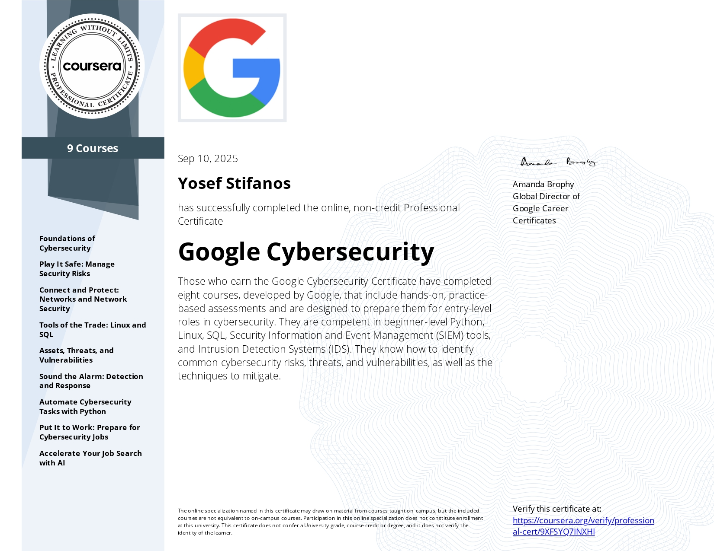

# Yosef Stifanos — Personal Website 🌐

Welcome to my personal website hosted at [yosefstifanos.github.io](https://yosefstifanos.github.io).  
This site serves as a digital portfolio to highlight my background, resume, and key projects in data science and cybersecurity.

---

## 🧠 About Me

- I'm a fourth-year Data Science student at the University of Illinois Urbana-Champaign with a focus on cybersecurity and analytics.  
- I’m passionate about technology, problem-solving, soccer (Go Man United!), and building things that make an impact.

---

## 📄 Resume

You can view my resume directly at:  
[📎 Yosef's Resume](https://yosefstifanos.github.io/Yosef_Resume_2026.pdf)

---

## 🔬 Projects

### 🔐 [NIST Password Generator + Passphrase Tool](https://yosefstifanos.github.io/NIST.html)
- Generates strong, random passwords that meet NIST guidelines.
- Checks passwords against known data breaches using the Have I Been Pwned API.
- Also generates secure passphrases using a Diceware-style approach.
- Technologies: `HTML`, `CSS`, `JavaScript`, [Have I Been Pwned API](https://haveibeenpwned.com/API/v3#PwnedPasswords)

---

### 🎮 [Game Sales Prediction & Playtime Classification](https://github.com/yosefstifanos/final_project)
- Built linear/logistic regression models to predict game sales and classify games by playtime.
- Evaluated models using R², RMSE, AUC, and accuracy.
- Technologies: `Python`, `Scikit-learn`, `Statsmodels`, `Jupyter Notebooks`

---

## 🏅 Certification

**Google Cybersecurity Professional Certificate**  
I completed the Google Cybersecurity Professional Certificate program, gaining hands-on experience in security operations, network defense, incident response, and more.

[View Certificate](https://coursera.org/share/f9bf6647320fe57074c391169d92f173)

---

## 🛠️ Tech Stack

**Languages:** Python, Java, JavaScript, HTML, CSS, SQL  
**Databases:** MySQL, MongoDB  
**Tools:** Git, Jira, Jupyter, Microsoft Office, Google Suite  
**Libraries:** Pandas, NumPy, Matplotlib, Scikit-learn

---

## 🚀 Visit the Site

Check out the live site here:  
👉 **[yosefstifanos.github.io](https://yosefstifanos.github.io)**

---

Feel free to connect on [LinkedIn](https://www.linkedin.com/in/yosefstifanos) or reach out at yosefstifanos30@gmail.com! I am always looking to improve my website, so please help me out with cool ideas!!!
